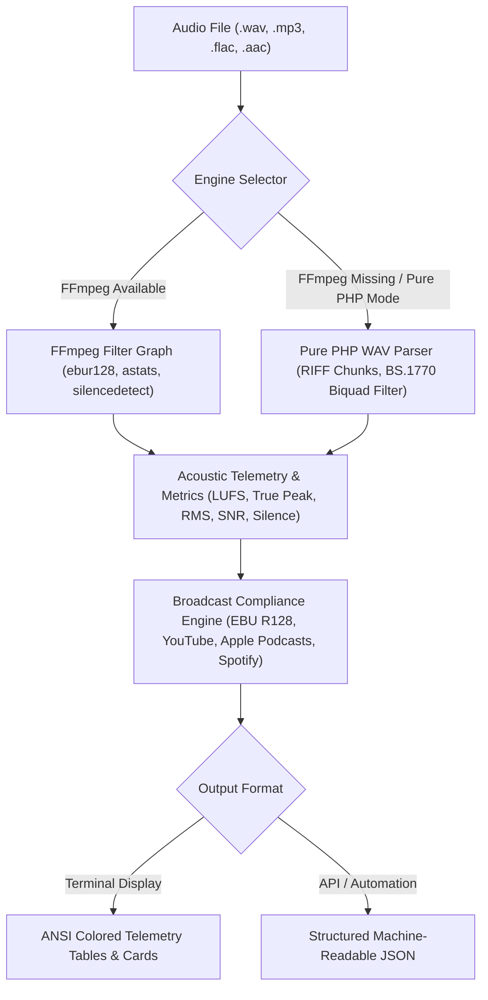

[🇸🇦 العربية](README.ar.md) | [🇬🇧 English](README.md)

# 🎙️ eidcloud-audio-inspector

> **Topics:** `eidcloud` `audio-engineering` `lufs-normalizer` `ebu-r128` `audio-forensics` `ffmpeg-wrapper` `php8`

[](https://github.com/shadialhasan/eidcloud-audio-inspector/releases)
[](https://www.php.net/)
[](LICENSE)
[](https://colab.research.google.com/github/shadialhasan/eidcloud-audio-inspector/blob/main/notebooks/quickstart.ipynb)

**eidcloud-audio-inspector** is an enterprise-grade audio forensics, acoustic measurement, and broadcast compliance analyzer built for **PHP 8.2+**. It calculates ITU-R BS.1770-4 / EBU R128 Integrated Loudness (LUFS), inter-sample True Peak (dBTP), Loudness Range (LRA), true RMS energy, Signal-to-Noise Ratio (SNR), digital clipping count, and silence ratios.

It features a **dual-engine architecture**: high-performance FFmpeg Libav filter graph execution when available, coupled with a zero-dependency **pure PHP 8.2 mathematical acoustic engine** that analyzes uncompressed RIFF/WAVE PCM headers, sample data, and 2-stage K-weighting biquad filters when FFmpeg is not installed.

---

## 🏗️ Architecture & Workflow



---

## ⚡ Core Capabilities

- **EBU R128 Integrated Loudness (LUFS)**: Accurate dual-stage K-weighting pre-filter and high-pass RLB gating algorithm adhering to ITU-R BS.1770-4.
- **Inter-Sample True Peak (dBTP)**: Detects inter-sample overshoots and digital peaks that cause analog distortion on digital-to-analog converters (DACs).
- **Loudness Range (LRA)**: Quantifies statistical dynamic variation between the 10th and 95th percentiles of gated blocks.
- **True RMS Energy (dBFS)**: Accurate continuous Root Mean Square signal power measurements.
- **Signal-to-Noise Ratio (SNR)**: Estimates background noise floor across quiet/silence intervals vs peak acoustic energy.
- **Silence Analysis**: Windowed energy tracking detecting total silent intervals, silence duration in seconds, and overall silence percentage.
- **Digital Rail Clipping Forensics**: Detects hard digital saturation (consecutive samples pinned at 0 dBFS / ±32767).
- **Compliance Matrix & Recommendations**: Evaluates audio against broadcast and streaming standards, providing gain offset makeup/reduction values and limiter ceiling targets.
- **Dual Engine Execution**: Operates seamlessly with FFmpeg or as a 100% standalone PHP tool for WAV PCM workflows.

---

## ⚖️ Supported Delivery Standards

| Standard ID | Name | Target Loudness | Tolerance | Max True Peak | Max LRA | Recommended Use |
| :--- | :--- | :--- | :--- | :--- | :--- | :--- |
| `ebu-r128` | **EBU R128** | **-23.0 LUFS** | ±0.5 LU | -1.0 dBTP | 18.0 LU | European TV, Radio & Broadcasters |
| `apple-podcasts` | **Apple Podcasts** | **-16.0 LUFS** | ±1.0 LU | -1.0 dBTP | Unrestricted | Spoken Word, Podcasts, Audiobooks |
| `youtube` | **YouTube** | **-14.0 LUFS** | ±1.0 LU | -1.0 dBTP | Unrestricted | Web Video & Streaming Music |
| `spotify` | **Spotify** | **-14.0 LUFS** | ±1.0 LU | -1.0 dBTP | Unrestricted | Commercial Music Streaming |

---

## 📦 Installation & Setup

### 1. Requirements
- **PHP 8.2.0 or higher** (extensions: `json`, `mbstring`).
- *(Optional but recommended)*: **FFmpeg** installed and accessible in system `PATH` (or specified via `FFMPEG_PATH`).

```bash
# Ubuntu / Debian
sudo apt-get update && sudo apt-get install -y php8.2-cli ffmpeg

# macOS (Homebrew)
brew install php ffmpeg

# Windows (Winget / Chocolatey)
winget install Gyan.FFmpeg
```

### 2. Composer Installation
```bash
composer require eidcloud/audio-inspector
```

Or clone the standalone repository:
```bash
git clone https://github.com/shadialhasan/eidcloud-audio-inspector.git
cd eidcloud-audio-inspector
```

---

## 💻 CLI Usage

The repository includes a ready-to-use executable CLI binary at `bin/eidcloud-audio`:

```bash
# Make binary executable (Unix)
chmod +x bin/eidcloud-audio

# Inspect an uncompressed WAV file (ANSI console report)
php bin/eidcloud-audio inspect master.wav

# Inspect against EBU R128 broadcast standard
php bin/eidcloud-audio inspect master.wav --standard=ebu-r128

# Inspect an MP3 file against YouTube specification with JSON output
php bin/eidcloud-audio inspect episode.mp3 --standard=youtube --json

# Force zero-dependency pure PHP WAV engine (bypasses FFmpeg)
php bin/eidcloud-audio inspect recording.wav --pure-php

# Generate a synthetic dynamic broadcast tone and inspect it
php bin/eidcloud-audio demo

# List all supported standards and specs
php bin/eidcloud-audio standards

# View help manual
php bin/eidcloud-audio --help
```

### CLI Options Reference
| Flag | Description | Default |
| :--- | :--- | :--- |
| `--standard=<id>` | Verify compliance against `ebu-r128`, `apple-podcasts`, `youtube`, or `spotify` | `null` |
| `--json` | Output machine-readable JSON payload | Disabled |
| `--no-ansi` | Disable ANSI terminal color codes | Enabled |
| `--pure-php` | Force pure PHP WAV parser even if FFmpeg is available | Disabled |
| `--silence=<dB>` | Silence RMS threshold in dBFS | `-60.0` |
| `-h`, `--help` | Show command documentation and usage | |
| `-v`, `--version` | Display version information | |

---

## 🛠️ PHP API Usage

### 1. Basic Inspection & Compliance Checking
```php
<?php

require_once __DIR__ . '/vendor/autoload.php';

use EidCloud\AudioInspector\Inspector;

$inspector = new Inspector();

// Run acoustic inspection
$metrics = $inspector->inspect('audio_master.wav');

echo "Integrated Loudness: " . $metrics->integratedLufs . " LUFS\n";
echo "True Peak Level:     " . $metrics->truePeakDbtp . " dBTP\n";
echo "RMS Level:           " . $metrics->rmsLevelDbfs . " dBFS\n";
echo "Signal-to-Noise:     " . $metrics->snrDb . " dB\n";
echo "Silence Ratio:       " . $metrics->silenceRatioPercent . "%\n";
echo "Clipped Samples:     " . $metrics->clippedSamples . "\n";

// Validate compliance against EBU R128
$compliance = $inspector->checkCompliance($metrics, 'ebu-r128');

if ($compliance->isCompliant) {
    echo "✔ Audio is broadcast compliant with EBU R128!\n";
} else {
    echo "✘ Non-compliant! Recommendations:\n";
    foreach ($compliance->recommendations as $rec) {
        echo "  - {$rec}\n";
    }
}
```

### 2. Generating Reference Test Signals
```php
use EidCloud\AudioInspector\Synthesizer\WavSynthesizer;

// Generate 1kHz reference sine wave at -23.0 LUFS / dBFS
WavSynthesizer::generateSineWave(
    outputPath: 'reference_23lufs.wav',
    frequencyHz: 1000.0,
    durationSec: 3.0,
    amplitudeDbfs: -23.0,
    sampleRate: 48000,
    channels: 2,
    bitsPerSample: 16
);

// Generate digital silence fixture
WavSynthesizer::generateSilence('silence.wav', durationSec: 2.0);

// Generate intentionally clipped audio for forensic calibration
WavSynthesizer::generateClippedTone('clipped.wav', overdriveDb: +6.0);
```

---

## 🧪 Running Tests

The test suite runs with **zero external dependencies** and verifies WAV chunk parsing, calibrated acoustic mathematics, silence detection, clipping detection, and broadcast standards:

```bash
# Run standalone test runner
php tests/run_tests.php

# Or via composer
composer test
```

### Sample Test Output
```text
========================================================================
  🎙️  EIDCLOUD AUDIO INSPECTOR - AUTOMATED TEST SUITE
  Zero-Dependency Verification: WAV Headers, Acoustic Forensics & Standards
========================================================================

  testWavHeaderParsingMonoAndStereo()                [ PASS ] (270.8ms)
  testPurePhpAcousticAnalysisAccuracy()              [ PASS ] (796.5ms)
  testSilenceDetectionAndRatio()                     [ PASS ] (1982.5ms)
  testDigitalClippingDetection()                     [ PASS ] (1899.2ms)
  testEbuR128CompliancePassingAndFailing()           [ PASS ] (7110.6ms)
  testStreamingStandardsAppleAndYouTube()            [ PASS ] (0.0ms)
  testStandardRegistryAliases()                      [ PASS ] (0.1ms)
  testSerializationAndDtoConsistency()               [ PASS ] (4064.1ms)
  testCliExecution()                                 [ PASS ] (3671.8ms)

────────────────────────────────────────────────────────────────────────
  ✔ ALL TESTS PASSED (9/9 tests) in 19807.8 ms
────────────────────────────────────────────────────────────────────────
```

---

## 👤 Author & Maintainer

**Eng. MHD. Shadi AL-Hasan**  
- **Role:** Executive CTO & Enterprise Solutions Architect  
- **Email:** [mhd.shadi.alhasan@gmail.com](mailto:mhd.shadi.alhasan@gmail.com)  
- **Phone / WhatsApp:** [+963934005922](tel:+963934005922)  
- **Location:** Damascus, Syria  
- **GitHub:** [shadialhasan](https://github.com/shadialhasan)  

---

## 📄 License

This project is licensed under the MIT License - see the [LICENSE](LICENSE) file for details.  
Copyright (c) 2026 **MHD. Shadi AL-Hasan**. All rights reserved.
